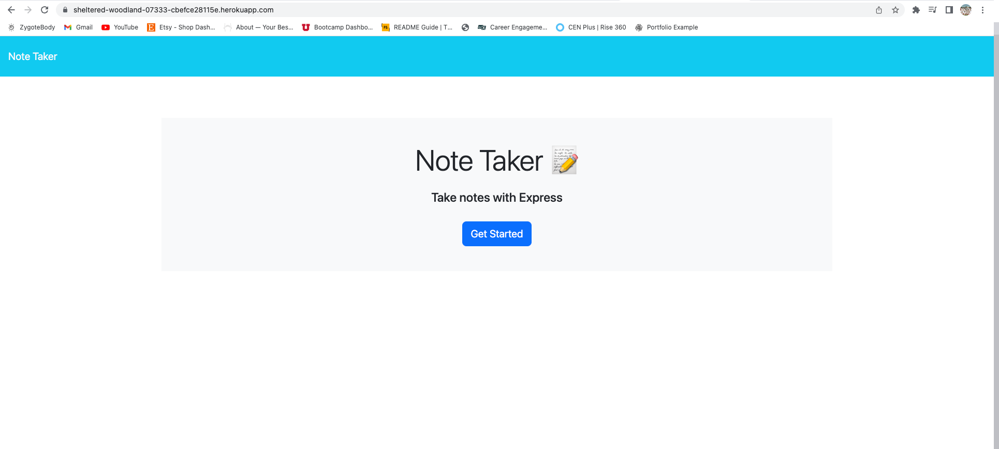
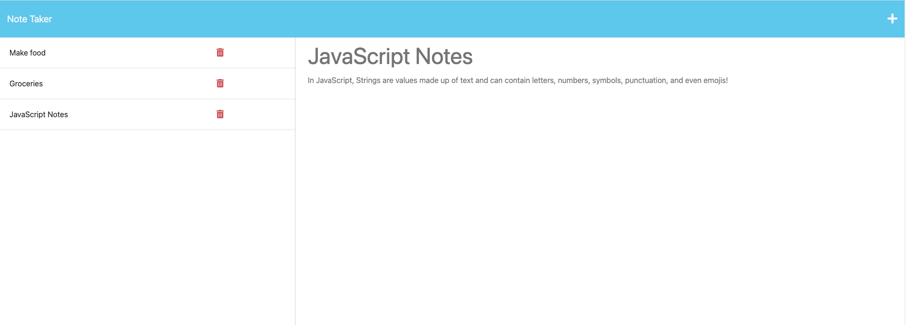

# Note Taker App

## Description

This is a simple note taking app that allows the user to write a note title followed by the note text. The user can also view past notes that are stored to the database.  Each note will show on the left hand side of the notes page.

## Usage
To use this application, please visit the url:
https://sheltered-woodland-07333-cbefce28115e.herokuapp.com/

Click "Get Started" and add notes. To view past notes taken, simply click on the note you wish to view on the left.

## Credits

npm packages used:
- express.js
- uuid

## License

Please see license in the repository

## Tests

N/A